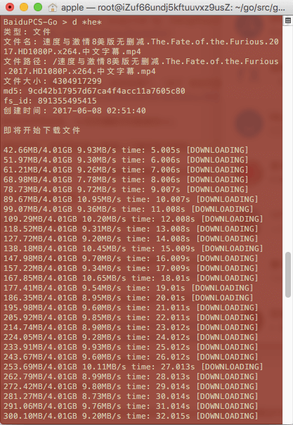

# BaiduPCS-Go 百度网盘工具箱 beta-v1
This project was largely inspired by [GangZhuo/BaiduPCS](https://github.com/GangZhuo/BaiduPCS)

# 特色

使用百度 BDUSS 登录百度网盘, 支持多用户, [关于 获取百度 BDUSS](https://github.com/iikira/BaiduPCS-Go/wiki/关于-获取百度-BDUSS);

网盘内列出文件和目录, **支持通配符匹配路径**;

下载网盘内文件, 支持高并发**高速**下载和断点续传;

> 下载测试:

> 服务器: 阿里云

> 下载 4G 文件, 只需 7分29秒

> 

> 自己感受一下吧

目前只支持下载单个文件, 暂不支持目录下载和多个文件下载. 

# 程序 下载/ 运行 说明

Go语言程序, 可直接下载使用, [点此查看发布页面 / 下载汇总](https://github.com/iikira/BaiduPCS-Go/releases).

如果程序输出乱码, 请检查下终端的编码方式是否为 UTF-8.

使用本程序, 强烈建议学习一些 linux 基础知识, [Linux20个常用命令](http://blog.csdn.net/xufei512/article/details/53321980).

程序应在 (Linux, macOS)终端／(Windows)命令提示符, PowerShell 中运行.

安卓, 建议使用软件 [Termux](https://termux.com) 或 [NeoTerm](https://github.com/NeoTerm/NeoTerm/releases) 或 终端模拟器, 以提供终端环境.

苹果iOS, 需要越狱, 在 Cydia 下载安装 Terminal, 以提供终端环境

Windows 也可直接双击程序运行.

如果未带任何参数运行程序, 程序将会进入独有的 console 模式, 可直接运行相关命令.

程序会提供相关命令的使用说明.

# 命令列表及说明

## 使用百度 BDUSS 来登录百度帐号
```
baidupcs_go login -bduss=<BDUSS>
```
```
baidupcs_go login

请输入百度BDUSS值, 回车键提交 > 
```

## 获取当前帐号, 和所有已登录的百度帐号
```
baidupcs_go loglist
```

## 切换已登录的百度帐号
```
baidupcs_go chuser -uid=12345678
```
```
baidupcs_go chuser

请输入要切换帐号的 index 值 > 
```

## 退出已登录的百度帐号
```
baidupcs_go logout -uid=12345678
```
```
baidupcs_go logout

请输入要退出帐号的 index 值 > 
```

## 获取配额, 即获取网盘总空间, 和已使用空间
```
baidupcs_go quota
```

## 切换工作目录
```
baidupcs_go cd <目录>
```

## 输出当前所在目录
```
baidupcs_go pwd
```

## 列出当前工作目录的文件和目录或指定目录
```
baidupcs_go ls
```
```
baidupcs_go ls <目录>
```

## 获取单个文件/目录的元信息 (详细信息)
```
baidupcs_go meta <目录>
```
```
baidupcs_go meta
```

## 下载文件, 网盘文件绝对路径或相对路径
```
baidupcs_go download <网盘文件的路径>
baidupcs_go d <网盘文件的路径>
```

下载的文件将会保存到, 程序所在目录的 download/ 目录 (文件夹), 暂不支持指定目录, 重名的文件将会被覆盖!

# 举一些例子 

新手建议: **双击运行程序**, 进入 console 模式;

console 模式下, 光标所在行的前缀应为 `BaiduPCS-Go >`

以下例子的命令, 均为 console 模式下的命令

运行命令的正确操作: **输入命令, 按一下回车键 (键盘上的 Enter 键)**, 程序会接收到命令并输出结果

## 1. 查看程序使用说明

console 模式下, 运行命令 `help`

## 2. 使用百度 BDUSS 来登录百度帐号 (必做)

[关于 获取百度 BDUSS](https://github.com/iikira/BaiduPCS-Go/wiki/关于-获取百度-BDUSS)

console 模式下, 运行命令 `login -h` (注意空格) 查看帮助

console 模式下, 运行命令 `login` 程序将会提示你输入 百度BDUSS 值

console 模式下, 运行命令 `login -bduss=<BDUSS>` 来设置 百度BDUSS 值, 设置时请替换掉 `<BDUSS>`

## 3. 切换网盘工作目录

console 模式下, 运行命令 `cd /我的资源` 将工作目录切换为 `/我的资源` (前提: 该目录存在于网盘)

目录支持通配符匹配, 所以你也可以这样: 运行命令 `cd /我的*` 或 `cd /我的??` 将工作目录切换为 `/我的资源`, 简化输入.

将工作目录切换为 `/我的资源` 成功后, 运行命令 `cd ..` 切换上级目录, 即将工作目录切换为 `/`

为什么要这样设计呢, 举个例子, 

假设 你要下载 `/我的资源` 内名为 `1.mp4` 和 `2.mp4` 两个文件, 而未切换工作目录, 你需要依次运行以下命令: 

```
d /我的资源/1.mp4
d /我的资源/2.mp4
```

而切换网盘工作目录之后, 依次运行以下命令: 

```
cd /我的资源
d 1.mp4
d 2.mp4
```

这样就达到了简化输入的目的

## 4. 网盘内列出文件和目录

console 模式下, 运行命令 `ls -h` (注意空格) 查看帮助

console 模式下, 运行命令 `ls` 来列出当前所在目录的文件和目录

console 模式下, 运行命令 `ls /我的资源` 来列出 `/我的资源` 内的文件和目录

console 模式下, 运行命令 `ls ..` 来列出当前所在目录的上级目录的文件和目录

## 5. 下载文件

说明: 下载的文件将会保存到, 程序所在目录的 download/ 目录 (文件夹)

console 模式下, 运行命令 `d -h` (注意空格) 查看帮助

console 模式下, 运行命令 `d /我的资源/1.mp4` 来下载位于 `/我的资源/1.mp4` 的文件 `1.mp4` , 该操作等效于运行以下命令: 

```
cd /我的资源
d 1.mp4
```

参见 例6 设置下载最大并发数

## 6. 设置下载最大并发数

console 模式下, 运行命令 `set -h` (注意空格) 查看设置帮助以及可供设置的值

console 模式下, 运行命令 `set max_parallel 250` 将下载最大并发数设置为 250

下载最大并发数建议值: 100~500, 太低下载速度提升不明显甚至速度会变为0, 太高可能会导致程序和系统超负荷

## 7. 退出程序

运行命令 `quit` 或 `exit` 或 组合键 `Ctrl+C` 或 组合键 `Ctrl+D`

# TODO

1. 网盘内文件或目录的复制, 移动, 删除等操作
2. 上传文件
3. 本地文件与云端同步
4. 下载目录